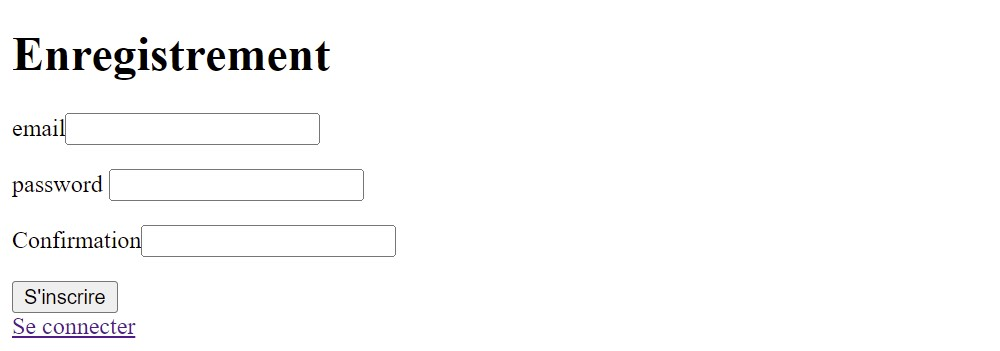

# projetfs
Création d'un mini-site de gestion de blog en PHP.

------------------------------

## Fonctionnalités

### S'enregistrer

L'utilisateur à la possiblité de créer son propre compte avec un email et un mot de passe.

### Se connecter

Si l'utilisateur possède un compte et que ses identifiants de connexion sont valides alors il arrive sur la page listant tous ses articles. Dans le cas contraire des indications sont affichées sur la page.

### Visualiser les articles de l'utilisateur

Si l'utilisateur est connecté alors il peut visualiser ses articles et ainsi agir dessus, c'est-à-dire les modifier.

### Ajouter un article

Une fois l'utilisateur connecté, il a la possibilté d'ajouter des articles. Pour cela il doit remplir le formulaire affiché, à savoir le titre et le corps de l'article. La date d'ajout est automatiquement ajouté dans la base de donnée.

### Modifier un article

Si l'utilisateur est connecté alors il a la possibilté de modifier ses articles. Pour cela il doit modifier le formulaire affiché, à savoir le titre et le corps de l'article. La date de modification est automatiquement ajouté dans la base de donnée.

### Déconnexion

Une fois l'utilisateur connecté, celui-ci peut se déconnecter à tout moment et depuis n'importe quelle page. Cela ferme la session mais supprime aussi le cookie du navigateur.

### Voir tous les articles et ajouter des commentaires

Pour tout les utilisateurs connectés ou non, ils peuvent avoir accès à la liste de tous les articles ainsi qu'à leur auteur. De plus il leur est donné la possibilité d'ajouter des commentaires, de voir les commentaires publiés et leur date de modification

### Visualiser les commentaires de l'utilisateur

Si l'utilisateur est connecté alors il peut visualiser ses commentaires et ainsi agir dessus, c'est-à-dire les modifier.

### Modifier un commentaire

Si l'utilisateur est connecté alors il a la possibilté de modifier ses commentaire. Pour cela il doit modifier le formulaire affiché, à savoir le texte du commentaire. La date de modification est automatiquement ajouté dans la base de donnée.

### Redirection automatique

Toutes les pages sont protégés et renvoient vers la page la plus adapté. Par exemple, un utilisateur non connecté ne peut pas ajouter ou modifier des articles tandis qu'un utilisateur connecté ne peut modifier que ses article à lui.

